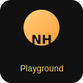

# naughty-heylees-playground

<p align="left"></p>

[](https://codecov.io/gh/heyleequin-droid/naughty-heylees-playground) [](https://github.com/heyleequin-droid/naughty-heylees-playground/actions)

Minimal TypeScript project (ES modules).

## Images

This repo includes a placeholder image at `public/images/placeholder.svg` so you can test adding and previewing images.

### Add your images
- Create a folder `public/images` and drop files there (or drag into VS Code Explorer).
- From the terminal (Linux/macOS):

```bash
mkdir -p public/images
cp ~/Downloads/your-image.png public/images/
```

- Commit & push:

```bash
git add public/images/*
git commit -m "Add images"
git push origin main
```

### Preview in the README
You can embed images in Markdown. Example:

```markdown

```

Preview this file in VS Code or on GitHub to see the image.

### Serve images locally
- Quick static server with Python:

```bash
python3 -m http.server --directory public 8000
# then open http://localhost:8000/images/placeholder.svg
```

---

If you want, drop your images in `public/images` now and I can commit them for you, or I can add a small Express static route to serve images automatically. Let me know which you prefer.

## Bar menu demo

A simple static demo is available at `public/bar.html`. To preview locally, run a quick static server from the project root and open the page in your browser:

```bash
python3 -m http.server --directory public 8000
# then open http://localhost:8000/bar.html
```

Or use `npx serve public`.

### Welcome page

You can preview a simple welcome page at `public/welcome.html` (it uses `public/images/placeholder.svg` by default). To open it locally:

```bash
python3 -m http.server --directory public 8000
# then open http://localhost:8000/welcome.html
```

Replace the image at `public/images/placeholder.svg` with your own files and use `/images/your-image.png` in the markup to show them.

## React component

A reusable React component is available at `src/components/BarMenu.tsx` (with styles in `src/components/BarMenu.module.css`). Example usage in a React + TypeScript app:

```tsx
import React from 'react';
import ReactDOM from 'react-dom/client';
import BarMenu from './components/BarMenu';

function App() {
  return (
    <div>
      <BarMenu />
    </div>
  );
}

ReactDOM.createRoot(document.getElementById('root')!).render(<App />);
```

Notes:
- The component uses the built-in `barMenu` data from `src/barMenu.ts` by default. Pass a custom `menu` prop if you want to override it.

### Coverage & Codecov

CI runs tests with coverage and will upload coverage artifacts. If you want Codecov reports and badges:

- Add the `CODECOV_TOKEN` secret to your repository (Settings → Secrets) if your repo is private. For public repos the Codecov action typically works without a token.
- The CI step will upload `coverage/lcov.info` to Codecov when the secret is present and display results on https://codecov.io.

Coverage thresholds are enforced by `scripts/checkCoverage.js` (defaults: statements/lines/functions 85%, branches 80%). Edit `scripts/checkCoverage.js` to change thresholds.

### Run the Vite demo

This repo now includes a tiny Vite + React demo. To run it locally:

```bash
# install dependencies
npm install

# start the dev server for the client
npm run dev
# open http://localhost:5173
```

The server files remain in `src/index.ts` if you prefer to run a backend concurrently (use `npm run dev:server`).
