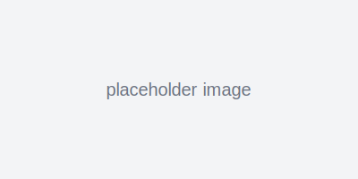

# naughty-heylees-playground

Minimal TypeScript project (ES modules).

## Images

This repo includes a placeholder image at `public/images/placeholder.svg` so you can test adding and previewing images.

### Add your images
- Create a folder `public/images` and drop files there (or drag into VS Code Explorer).
- From the terminal (Linux/macOS):

```bash
mkdir -p public/images
cp ~/Downloads/your-image.png public/images/
```

- Commit & push:

```bash
git add public/images/*
git commit -m "Add images"
git push origin main
```

### Preview in the README
You can embed images in Markdown. Example:

```markdown

```

Preview this file in VS Code or on GitHub to see the image.

### Serve images locally
- Quick static server with Python:

```bash
python3 -m http.server --directory public 8000
# then open http://localhost:8000/images/placeholder.svg
```

---

If you want, drop your images in `public/images` now and I can commit them for you, or I can add a small Express static route to serve images automatically. Let me know which you prefer.
